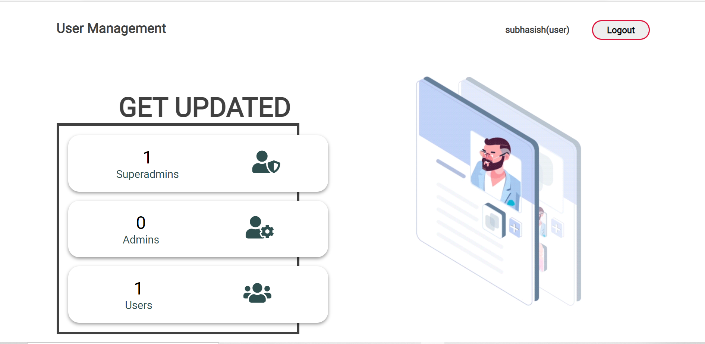

# User-management-system
A web app use to manage staff of an organization and keep update of employees. And this application is Completely created in Flask framework.<br><br>

<br><br>

<br><br>
This application is not hosted so to run this on localhost follow these steps:<br>
* Download the zip file
* Then extract the file in a Folder
* Now create a database in Mysql with name 'python_13.db'
* And then import the 'python_13.db' in that database
* Install all the requirements:<br>
```pip install flask```
```pip install Mysql```
* Then get to that folder and run the command:<br>
```python main.py```<br><br>
Now this web app is running on the localhost.


